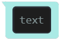
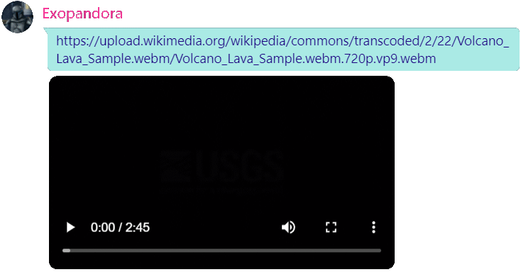
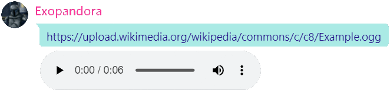
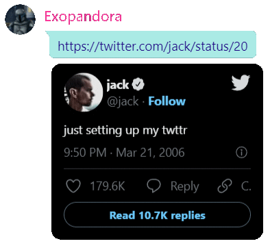
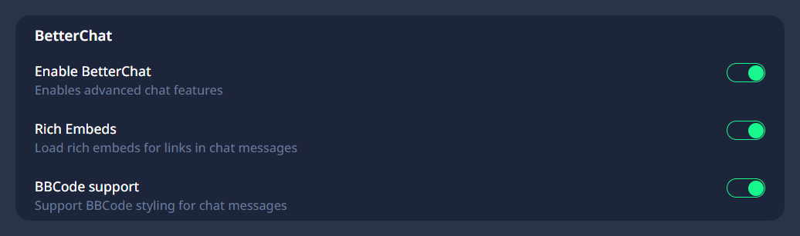

# BetterChat #
BetterChat is an unofficial addon for TeamSpeak 5 and aims to provide a better chat experience for the TeamSpeak 5 client. It enables support for BBCodes, improving messages sent by TeamSpeak 3 users, and automatic rich embeds for video, audio, image and twitter content. It works in both compact and detailed view.

## BBCode support ##  
BetterChat readds support for BBCodes in chat, just like in TeamSpeak 3. Currently the following tags are supported:

| Name | Syntax  | Example |
| - | - | - |
| bold  | [b]text[/b] |  |
| code | [code]text[/code] |  |
| color | [color=hexcode]text[/color] or [color=color]text[/color] |  |
| italic | [i]text[/i] |  |
| spoiler | [spoiler]text[/spoiler] |  |
| strike | [s]text[/s] |  |
| underline | [u]text[/u] |  |
| url | [url]link[/url] or [url=link]text[/url] |  |

## Rich Embeds ##
BetterChat supports automatic embedding of any audio or video content. It also supports image and twitter embedding. Due to technical reasons it is not possible to automatically create embeds for other resources.

### Video Embed ###

### Audio Embed ### 

### Twitter Embed ###

Due to technical limitations not all video and audio formats are supported at the moment.

## Styling ##
Custom styling for the image preview can be changed in the `style.css`.
Rich embeds use the already existing css classes of the TeamSpeak client and should be compatible with already existing themes.

## Installation ##
⚠️ The current version of TeamSpeak 5 (beta-71) is incompatible at the moment

Notes:
* Depending on your installation directory you may need elevated permission privileges
* The installation process needs to be repeated after each TeamSpeak update
### Installer ###
Installation steps:
1. Download the installer for your operating system from [here](https://github.com/FelixVolo/TS5AddonInstaller/releases)
2. Start the installer
3. Select your TeamSpeak installation directory
4. Select "BetterChat"
5. Click on "Install"

### Manual ###
Installation steps:
1. Navigate to your TeamSpeak installation directory
2. Navigate to `./html/client_ui/`
3. Open `index.html` in that directory with an editor and copy all the contents from the `index.html` of this repository before `</head>` and save the file
4. Create a new folder named `betterchat`
5. Copy all the contents from `src/` into the newly created folder
6. And you are done! You can now start TeamSpeak

## Configuration ##
BetterChat can be enabled and disabled while TeamSpeak is running.
Just go to the settings menu inside TeamSpeak and navigate to Behavior.
There you can toggle specific features, like BBCode support or Rich Embeds, or enable and disable the addon entirely.

