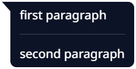
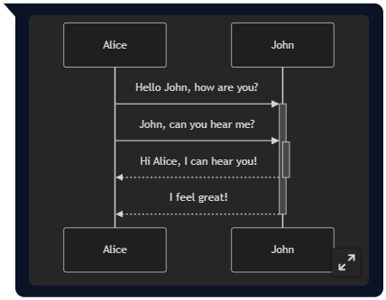

# BetterChat #
BetterChat is an unofficial addon for TeamSpeak 6 and aims to provide a better chat experience for the TeamSpeak 6 client.
It enables support for BBCodes, improving messages sent by TeamSpeak 3 users, and automatic rich embeds for any website, including dedicated embeds for video, audio, image and twitter content.
It works in both compact and detailed view.

## BBCode support ##  
BetterChat readds support for BBCodes in chat, just like in TeamSpeak 3.
Currently, the following tags are supported:

| Code           | Syntax                                                                                                                                                                                                                                                                                                                                                                                                                                                                                                                                                                                                                                                                  | Example                                                                                                                             |
|----------------|-------------------------------------------------------------------------------------------------------------------------------------------------------------------------------------------------------------------------------------------------------------------------------------------------------------------------------------------------------------------------------------------------------------------------------------------------------------------------------------------------------------------------------------------------------------------------------------------------------------------------------------------------------------------------|-------------------------------------------------------------------------------------------------------------------------------------|
| bold           | [b]bold[/b]                                                                                                                                                                                                                                                                                                                                                                                                                                                                                                                                                                                                                                                             |                                                                                                     |
| code           | [code]text[/code]                                                                                                                                                                                                                                                                                                                                                                                                                                                                                                                                                                                                                                                       |                                                                                                     |
| color          | [color=#FFA500]hexcode[/color] or [color=orange]css color[/color]                                                                                                                                                                                                                                                                                                                                                                                                                                                                                                                                                                                                       |                                                                                                   |
| italic         | [i]italic[/i]                                                                                                                                                                                                                                                                                                                                                                                                                                                                                                                                                                                                                                                           |                                                                                                 |
| spoiler        | [spoiler]spoiler[/spoiler]                                                                                                                                                                                                                                                                                                                                                                                                                                                                                                                                                                                                                                              |                                                                                               |
| strike         | [s]strike[/s]                                                                                                                                                                                                                                                                                                                                                                                                                                                                                                                                                                                                                                                           |                                                                                                 |
| underline      | [u]underline[/u]                                                                                                                                                                                                                                                                                                                                                                                                                                                                                                                                                                                                                                                        |                                                                                           |
| url            | [url]ht<span>tps://example.com[/url] or [url=ht<span>tps://example.com]text[/url]                                                                                                                                                                                                                                                                                                                                                                                                                                                                                                                                                                                       |                                                                                                       |
| pre            | [pre]inline code[/pre]                                                                                                                                                                                                                                                                                                                                                                                                                                                                                                                                                                                                                                                  |                                                                                                       |
| superscript    | [sup]superscript[/sup]                                                                                                                                                                                                                                                                                                                                                                                                                                                                                                                                                                                                                                                  |                                                                                       |
| subscript      | [sub]subscript[/sub]                                                                                                                                                                                                                                                                                                                                                                                                                                                                                                                                                                                                                                                    |                                                                                           |
| details        | [details]collapsed text[/details] or [details="summary"]collapsed text[/details]                                                                                                                                                                                                                                                                                                                                                                                                                                                                                                                                                                                        | <br/>             |
| hr             | first paragraph[hr]second paragraph                                                                                                                                                                                                                                                                                                                                                                                                                                                                                                                                                                                                                                     |                                                                                             |
| h1             | [h1]heading 1[/h1]                                                                                                                                                                                                                                                                                                                                                                                                                                                                                                                                                                                                                                                      |                                                                                             |
| h2             | [h2]heading 2[/h2]                                                                                                                                                                                                                                                                                                                                                                                                                                                                                                                                                                                                                                                      |                                                                                             |
| h3             | [h3]heading 3[/h3]                                                                                                                                                                                                                                                                                                                                                                                                                                                                                                                                                                                                                                                      |                                                                                             |
| h4             | [h4]heading 4[/h4]                                                                                                                                                                                                                                                                                                                                                                                                                                                                                                                                                                                                                                                      |                                                                                             |
| h5             | [h5]heading 5[/h5]                                                                                                                                                                                                                                                                                                                                                                                                                                                                                                                                                                                                                                                      |                                                                                             |
| h6             | [h6]heading 6[/h6]                                                                                                                                                                                                                                                                                                                                                                                                                                                                                                                                                                                                                                                      |                                                                                             |
| center         | [center]centered text[/center]                                                                                                                                                                                                                                                                                                                                                                                                                                                                                                                                                                                                                                          |                                                                                                 |
| left           | [left]left aligned text[/left]                                                                                                                                                                                                                                                                                                                                                                                                                                                                                                                                                                                                                                          |                                                                                                     |
| right          | [right]right aligned text[/right]                                                                                                                                                                                                                                                                                                                                                                                                                                                                                                                                                                                                                                       |                                                                                                   |
| highlight      | [highlight]highlighted text[/highlight]                                                                                                                                                                                                                                                                                                                                                                                                                                                                                                                                                                                                                                 |                                                                                           |
| footnote or fn | text[footnote]footnote[/footnote]                                                                                                                                                                                                                                                                                                                                                                                                                                                                                                                                                                                                                                       |                                                                                             |
| ol             | [ol]<br/>&nbsp;&nbsp;[li]first item[/li]<br/>&nbsp;&nbsp;[li]second item[/li]<br/>[/ol]                                                                                                                                                                                                                                                                                                                                                                                                                                                                                                                                                                                 |                                                                                               |
| ul             | [ul]<br/>&nbsp;&nbsp;[li]first item[/li]<br/>&nbsp;&nbsp;[li]second item[/li]<br/>[/ul]                                                                                                                                                                                                                                                                                                                                                                                                                                                                                                                                                                                 |                                                                                             |
| list           | [list]<br/>&nbsp;&nbsp;[li]first item[/li]<br/>&nbsp;&nbsp;[li]second item[/li]<br/>[/list]<br/><br/>List tags optionally support setting the list item style type:<br/><ul><li>Unordered lists: "disc", "circle", "square"</li><li>Ordered lists: "1", "i", "I", "a", "A"</li></ul>Example:<br/><br/>[list=square]<br/>&nbsp;&nbsp;[li]first item[/li]<br/>&nbsp;&nbsp;[li]second item[/li]<br/>[/list]<br/><br/>List items can be turned into task items by setting their tag value to either "o" for unckecked or "x" for checked task items. Example:<br/><br/>[list]<br/>&nbsp;&nbsp;[li=x]checked item[/li]<br/>&nbsp;&nbsp;[li=o]unchecked item[/li]<br/>[/list] | <br/><br/> |
| table          | [table]<br/>&nbsp;&nbsp;[tr]<br/>&nbsp;&nbsp;&nbsp;&nbsp;[th]first header[/th]<br/>&nbsp;&nbsp;&nbsp;&nbsp;[th]second header[/th]<br/>&nbsp;&nbsp;[/tr]<br/>&nbsp;&nbsp;[tr]<br/>&nbsp;&nbsp;&nbsp;&nbsp;[td]first value[/td]<br/>&nbsp;&nbsp;&nbsp;&nbsp;[td]second value[/td]<br/>&nbsp;&nbsp;[/tr]<br/>[/table]                                                                                                                                                                                                                                                                                                                                                      |                                                                                                   |
| math or tex    | [math]2+2=4[/math] or [tex]2+2=4[/tex]                                                                                                                                                                                                                                                                                                                                                                                                                                                                                                                                                                                                                                  |                                                                                                     |
| quote          | [quote]quoted text[/quote] or [quote="title"]quoted text[/quote]                                                                                                                                                                                                                                                                                                                                                                                                                                                                                                                                                                                                        |                                                                                                   |
| note           | [note]note[/note]                                                                                                                                                                                                                                                                                                                                                                                                                                                                                                                                                                                                                                                       |                                                                                                     |
| tip            | [tip]tip[/tip]                                                                                                                                                                                                                                                                                                                                                                                                                                                                                                                                                                                                                                                          |                                                                                                       |
| important      | [important]important[/important]                                                                                                                                                                                                                                                                                                                                                                                                                                                                                                                                                                                                                                        |                                                                                           |
| warning        | [warning]warning[/warning]                                                                                                                                                                                                                                                                                                                                                                                                                                                                                                                                                                                                                                              |                                                                                               |
| caution        | [caution]caution[/caution]                                                                                                                                                                                                                                                                                                                                                                                                                                                                                                                                                                                                                                              |                                                                                               |
| mermaid or mmd | [mermaid]<br/>sequenceDiagram<br/>&nbsp;&nbsp;Alice->>+John: Hello John, how are you?<br/>&nbsp;&nbsp;Alice->>+John: John, can you hear me?<br/>&nbsp;&nbsp;John-->>-Alice: Hi Alice, I can hear you<br/>&nbsp;&nbsp;John-->>-Alice: I feel great!<br/>[/mermaid]                                                                                                                                                                                                                                                                                                                                                                                                       |                                                                                               |

Tag values can optionally be surrounded by double-quotes in order to include closing square bracket characters. The double-quotes themselves can be escaped using a backslash. Example: `[details="A quoted tag value including a \" and a ] character"]`.

## Rich Embeds ##
BetterChat supports automatic rich embeds for any website, including dedicated embeds for video, audio, image and twitter content.
Due to technical limitations, not all video and audio formats are supported at the moment.

### Video Embed ###


### Audio Embed ###


### Twitter Embed ###


### Generic Embed ###


## Styling ##
Custom styling for the image preview can be changed in the `static/betterchat/style.css`.
Rich embeds use the already existing CSS classes of the TeamSpeak client and should be compatible with already existing themes.

## Installation ##
> [!NOTE]
> * Depending on your installation directory you may need elevated permission privileges
> * The installation process needs to be repeated after each TeamSpeak update
> * Please check the [compatibility](https://github.com/Exopandora/BetterChat#compatibility) section before installing BetterChat
> * Installation for TeamSpeak 5 requires the [TS5AddonInstaller](https://github.com/FelixVolo/TS5AddonInstaller/releases)

### Installer ###
Installation steps:
1. Download the TS6AddonInstaller for your operating system from [here](https://github.com/Exopandora/TS6AddonInstaller/releases)
2. Start the installer
3. Select your TeamSpeak installation directory
4. Select "BetterChat"
5. Click on "Install"

## Configuration ##
BetterChat can be enabled and disabled while TeamSpeak is running.
Simply navigate to the Chats category of the TeamSpeak settings.
There you can toggle individual features, like BBCode support or Rich Embeds, or enable and disable the addon entirely.


## Building from source ##

### Requirements ###
1. A recent Node.js installation

### Compiling ###
Clone the repository and run the following commands in the root directory of this repository:
```shell
npm install
npm run build
```
The resulting archive can be found in the `build/dist` directory.

## Compatibility ##

| TeamSpeak 6 | Windows | Linux  | MacOS  |
|-------------|---------|--------|--------|
| Beta 3.4    | 3.4.0+  | 3.4.0+ | 3.4.0+ |
| Beta 3.3    | ❌       | ❌      | ❌      |
| Beta 3.2    | 3.3.0+  | 3.3.0+ | 3.3.0+ |
| Beta 3.1    | 3.2.0+  | 3.2.0+ | 3.2.0+ |
| Beta 3      | 3.1.0+  | 3.1.0+ | 3.1.0+ |
| Beta 2      | 3.0.0+  | 3.0.0+ | 3.0.0+ |

<details>
<summary>TeamSpeak 5</summary>

| TeamSpeak 5 | Windows       | Linux         | MacOS         |
|-------------|---------------|---------------|---------------|
| Beta 77     | 2.5.0-2.6.1   | 2.5.0-2.6.1   | 2.5.0-2.6.1   |
| Beta 76     | 2.4.0+        | 2.4.0+        | 2.4.0+        |
| Beta 75     | 2.3.0+        | 2.3.0+        | 2.3.0+        |
| Beta 74     | 2.1.0 - 2.2.1 | 2.1.0 - 2.2.1 | 2.1.0 - 2.2.1 |
| Beta 73     | 1.2.0 - 2.2.1 | 1.2.0 - 2.2.1 | 1.2.0 - 2.2.1 |
| Beta 72     | 1.1.0 - 2.2.1 | 1.1.0 - 2.2.1 | n/a           |
| Beta 71     | ❌             | ❌             | n/a           |
| Beta 70     | 1.0.0 - 1.0.4 | 1.0.0 - 1.0.4 | 1.0.0 - 1.0.4 |

</details>
