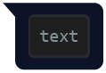
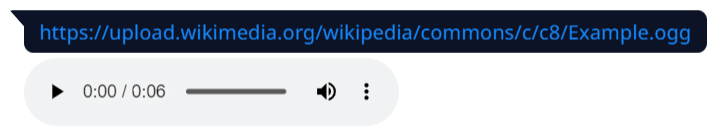
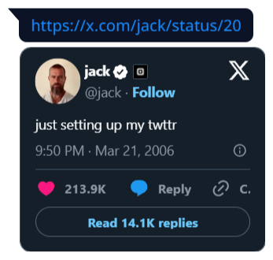
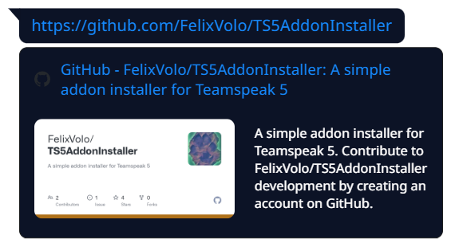

# BetterChat #
BetterChat is an unofficial addon for TeamSpeak 6 and aims to provide a better chat experience for the TeamSpeak 6 client.
It enables support for BBCodes, improving messages sent by TeamSpeak 3 users, and automatic rich embeds for any website, including dedicated embeds for video, audio, image and twitter content.
It works in both compact and detailed view.

## BBCode support ##  
BetterChat readds support for BBCodes in chat, just like in TeamSpeak 3.
Currently, the following tags are supported:

| Name | Syntax  | Example |
| ---- | ------- | ------- |
| bold  | [b]bold[/b] |  |
| code | [code]text[/code] |  |
| color | [color=#FFA500]hexcode[/color] or [color=orange]css color[/color] |  |
| italic | [i]italic[/i] |  |
| spoiler | [spoiler]spoiler[/spoiler] |  |
| strike | [s]strike[/s] |  |
| underline | [u]underline[/u] |  |
| url | [url]https://example.com[/url] or [url=https://example.com]text[/url] |  |
| pre | [pre]inline code[/pre] |  |

## Rich Embeds ##
BetterChat supports automatic rich embeds for any website, including dedicated embeds for video, audio, image and twitter content.
Due to technical limitations, not all video and audio formats are supported at the moment.

### Video Embed ###

### Audio Embed ###

### Twitter Embed ###

### Generic Embed ###

## Styling ##
Custom styling for the image preview can be changed in the `style.css`.
Rich embeds use the already existing css classes of the TeamSpeak client and should be compatible with already existing themes.

## Installation ##
> [!NOTE]
> * Depending on your installation directory you may need elevated permission privileges
> * The installation process needs to be repeated after each TeamSpeak update
> * Please check the [compatibility](https://github.com/Exopandora/BetterChat#compatibility) section before installing BetterChat

### Installer ###
Installation steps:
1. Download the TS6AddonInstaller for your operating system from [here](https://github.com/Exopandora/TS6AddonInstaller/releases)
2. Start the installer
3. Select your TeamSpeak installation directory
4. Select "BetterChat"
5. Click on "Install"

## Configuration ##
BetterChat can be enabled and disabled while TeamSpeak is running.
Just go to the settings menu inside TeamSpeak and navigate to Chats.
There you can toggle specific features, like BBCode support or Rich Embeds, or enable and disable the addon entirely.

## Compatibility ##

### TeamSpeak 6 ###
| TeamSpeak | Windows | Linux | MacOS |
| --------- | ------- | ----- | ----- |
| Beta 3 | 3.1.0+ | 3.1.0+ | 3.1.0+ |
| Beta 2 | 3.0.0+ | 3.0.0+ | 3.0.0+ |

### TeamSpeak 5 ###
> [!NOTE]
> Installation for TeamSpeak 5 requires the [TS5AddonInstaller](https://github.com/FelixVolo/TS5AddonInstaller/releases)

| TeamSpeak | Windows | Linux | MacOS |
| --------- | ------- | ----- | ----- |
| Beta 77 | 2.5.0-2.6.1 | 2.5.0-2.6.1 | 2.5.0-2.6.1 |
| Beta 76 | 2.4.0+ | 2.4.0+ | 2.4.0+ |
| Beta 75 | 2.3.0+ | 2.3.0+ | 2.3.0+ |
| Beta 74 | 2.1.0 - 2.2.1 | 2.1.0 - 2.2.1 | 2.1.0 - 2.2.1 |
| Beta 73 | 1.2.0 - 2.2.1 | 1.2.0 - 2.2.1 | 1.2.0 - 2.2.1 |
| Beta 72 | 1.1.0 - 2.2.1 | 1.1.0 - 2.2.1 | n/a |
| Beta 71 | ❌ | ❌ | n/a |
| Beta 70 | 1.0.0 - 1.0.4 | 1.0.0 - 1.0.4 | 1.0.0 - 1.0.4 |
